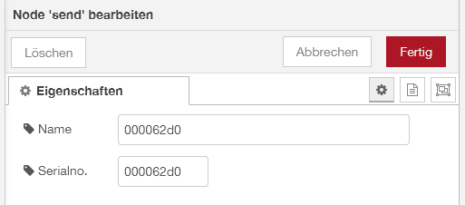
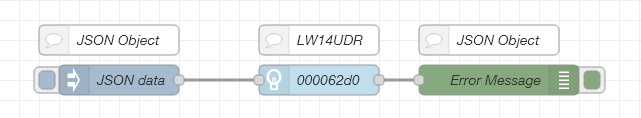
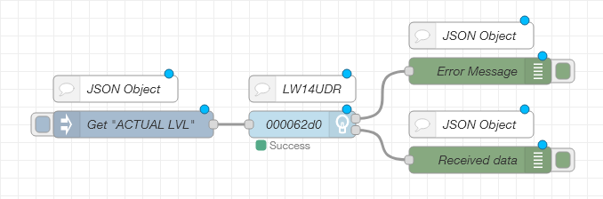

This node-red nodes communicate with the LED-Warrior14U-DR on a Raspberry PI / Linux.
------------
This package is deveoped and testet on Linux/Raspberry PI.

## Install NODE
Copy the folder 'node-cm-lw14udr-hid' into ~./node-red/node_modules and start/restart your Node-Red server.  
You need also the node-js component 'node-hid' from https://github.com/node-hid/node-hid. Please follow the install instructions on this github page

------------

## Permissions
You have to grant permissions for using the USB interface for the LED-Warrior14U-DR.
Copy the 99-iowarrior.rules file into '/etc/udev/rules.d' or '/lib/udev/rules.d/' and
reload the rules by using 
```
udevadm control --reload-rules && udevadm trigger
```
or replug the LED-Warrior14U-DR.

------------

## Usage
There are two functions for this node, 'SEND' and 'RECEIVE'. Both need a serial number of LED-Warrior14UDR to communicate. To get the serial number you can use this command on Linux:

```
lsusb -d 07c0: -v 2>/dev/null | grep "iSerial"
```

You will get an value of 8 hexadecimal digits for each connected LED-Warrior14UDR, which you have to use for the nodes.  
  

  
**Name**: The name of the node (optional)  
**Serialno.**: Must be the serial number (not case sensitive) of the LED-Warrior14UDR (required)  

*Both nodes will return an error message in JSON format.*
```
{
	"type": "error",
	"code": <int>,
	"msg": <string>
}
```
**Error codes:**  
0: No Error  
1: No LED-Warrior14UDR with given serial found/connected  
2: Bus is busy (someone is active on the bus)  
4: Bus fault (no bus, short or other fatal errors)  
8: Input error in JSON object  
16: General bus error  

------------

## Send
This node will send 8 bit telegrams. As input mus be a JSON object or string in JSON format. As output it will return an error message.  

*Input JSON*
```
{
	"mode": <int>,
	"type": <int>,
	"adr": <int>,
	"value": <int>
}
```

**mode**: This will define the type of commands, 0=DACP, 1=COMMAND  
**type**: This will define the address type, 0=BROADCAST, 1=GROUP, 2=SINGLE  
**adr**: The device address between 0 and 63  
**value**: The value which will be send  

*Example*  
  

------------

## Receive
This node will send a QUERY command to a single device and receive the answere and an error messages both in JSON format. Query commands are onle possible on single devices, not on groups or broadcast.

*Input JSON*
```
{
	"adr": <int>
	"value" < int>
}
```

**adr**: The device address between 0..63. Only single devices are possible.  
**value**: The query which will be send  

*Output*
```
{
	"adr": <int>
	"query": < int>
	"size": <int>
	"data": <array>
}
```

**adr**: The device address which is asked for, 0..63  
**query**: The query command which asked for  
**size**: The size of the received telegram, 1=8bit, 2=16bit, 3=24Bit  
**data**: An array with the data, the size is equal to 'size'  


The receive function has two outputs, one for the error message, and one for the recevied data, 
both in JSON format. If an error occurs the data object will be '-1' on each JSON entry.

*Example*  
  

------------
<br><br>


## DACP values to %-Output
Send a DACP (direct light output) value to a device/group/broadcast. The value 0..254 based on the output of the device (linear or logarithmic). For more information about the steps please take a look into the data sheet of your device.

Table for logarithmic DACP ouput. N = DACP value, %X = Light output

| N | X% | N | X% | N | X% | N | X% | N | X% |
|  ------------  |  ------------  |  ------------  |  ------------  |  ------------  |  ------------  |  ------------  |  ------------  |  ------------  |  ------------  | 
| 1 | 0,100 | 52 | 0,402 | 103 | 1,620 | 154 | 6,520 | 205 | 26,241 |
| 2 | 0,103 | 53 | 0,414 | 104 | 1,665 | 155 | 6,700 | 206 | 26,967 |
| 3 | 0,106 | 54 | 0,425 | 105 | 1,711 | 156 | 6,886 | 207 | 27,713 |
| 4 | 0,109 | 55 | 0,437 | 106 | 1,758 | 157 | 7,076 | 208 | 28,480 |
| 5 | 0,112 | 56 | 0,449 | 107 | 1,807 | 158 | 7,272 | 209 | 29,269 |
| 6 | 0,115 | 57 | 0,461 | 108 | 1,857 | 159 | 7,473 | 210 | 30,079 |
| 7 | 0,118 | 58 | 0,474 | 109 | 1,908 | 160 | 7,680 | 211 | 30,911 |
| 8 | 0,121 | 59 | 0,487 | 110 | 1,961 | 161 | 7,893 | 212 | 31,767 |
| 9 | 0,124 | 60 | 0,501 | 111 | 2,015 | 162 | 8,114 | 213 | 32,646 |
| 10 | 0,128 | 61 | 0,515 | 112 | 2,071 | 163 | 8,336 | 214 | 33,550 |
| 11 | 0,131 | 62 | 0,529 | 113 | 2,128 | 164 | 8,567 | 215 | 34,479 |
| 12 | 0,135 | 63 | 0,543 | 114 | 2,187 | 165 | 8,804 | 216 | 35,433 |
| 13 | 0,139 | 64 | 0,559 | 115 | 2,248 | 166 | 9,047 | 217 | 36,414 |
| 14 | 0,143 | 65 | 0,574 | 116 | 2,310 | 167 | 9,298 | 218 | 37,422 |
| 15 | 0,147 | 66 | 0,590 | 117 | 2,374 | 168 | 9,555 | 219 | 38,457 |
| 16 | 0,151 | 67 | 0,606 | 118 | 2,440 | 169 | 9,820 | 220 | 39,522 |
| 17 | 0,155 | 68 | 0,623 | 119 | 2,507 | 170 | 10,091 | 221 | 40,616 |
| 18 | 0,159 | 69 | 0,640 | 120 | 2,577 | 171 | 10,371 | 222 | 41,740 |
| 19 | 0,163 | 70 | 0,658 | 121 | 2,648 | 172 | 10,658 | 223 | 42,895 |
| 20 | 0,168 | 71 | 0,676 | 122 | 2,721 | 173 | 10,953 | 224 | 44,083 |
| 21 | 0,173 | 72 | 0,695 | 123 | 2,797 | 174 | 11,256 | 225 | 45,303 |
| 22 | 0,177 | 73 | 0,714 | 124 | 2,874 | 175 | 11,568 | 226 | 46,557 |
| 23 | 0,182 | 74 | 0,734 | 125 | 2,954 | 176 | 11,888 | 227 | 47,846 |
| 24 | 0,187 | 75 | 0,754 | 126 | 3,035 | 177 | 12,217 | 228 | 49,170 |
| 25 | 0,193 | 76 | 0,775 | 127 | 3,119 | 178 | 12,555 | 229 | 50,531 |
| 26 | 0,198 | 77 | 0,796 | 128 | 3,206 | 179 | 12,902 | 230 | 51,930 |
| 27 | 0,203 | 78 | 0,819 | 129 | 3,294 | 180 | 13,260 | 231 | 53,367 |
| 28 | 0,209 | 79 | 0,841 | 130 | 3,386 | 181 | 13,627 | 232 | 54,844 |
| 29 | 0,215 | 80 | 0,864 | 131 | 3,479 | 182 | 14,004 | 233 | 56,362 |
| 30 | 0,221 | 81 | 0,888 | 132 | 3,576 | 183 | 14,391 | 234 | 57,922 |
| 31 | 0,227 | 82 | 0,913 | 133 | 3,675 | 184 | 14,790 | 235 | 59,526 |
| 32 | 0,233 | 83 | 0,938 | 134 | 3,776 | 185 | 15,199 | 236 | 61,173 |
| 33 | 0,240 | 84 | 0,964 | 135 | 3,881 | 186 | 15,620 | 237 | 62,866 |
| 34 | 0,246 | 85 | 0,994 | 136 | 3,988 | 187 | 16,052 | 238 | 64,607 |
| 35 | 0,253 | 86 | 1,018 | 137 | 4,099 | 188 | 16,496 | 239 | 66,395 |
| 36 | 0,260 | 87 | 1,047 | 138 | 4,212 | 189 | 16,953 | 240 | 68,233 |
| 37 | 0,267 | 88 | 1,076 | 139 | 4,329 | 190 | 17,422 | 241 | 70,121 |
| 38 | 0,275 | 89 | 1,105 | 140 | 4,449 | 191 | 17,905 | 242 | 72,062 |
| 39 | 0,282 | 90 | 1,136 | 141 | 4,572 | 192 | 18,400 | 243 | 74,057 |
| 40 | 0,290 | 91 | 1,167 | 142 | 4,698 | 193 | 18,909 | 244 | 76,107 |
| 41 | 0,298 | 92 | 1,200 | 143 | 4,828 | 194 | 19,433 | 245 | 78,213 |
| 42 | 0,306 | 93 | 1,233 | 144 | 4,962 | 195 | 19,971 | 246 | 80,378 |
| 43 | 0,315 | 94 | 1,267 | 145 | 5,099 | 196 | 20,524 | 247 | 82,603 |
| 44 | 0,324 | 95 | 1,302 | 146 | 5,240 | 197 | 21,092 | 248 | 84,889 |
| 45 | 0,332 | 96 | 1,338 | 147 | 5,385 | 198 | 21,675 | 249 | 87,239 |
| 46 | 0,342 | 97 | 1,375 | 148 | 5,535 | 199 | 22,275 | 250 | 89,654 |
| 47 | 0,351 | 98 | 1,413 | 149 | 5,688 | 200 | 22,892 | 251 | 92,135 |
| 48 | 0,361 | 99 | 1,452 | 150 | 5,845 | 201 | 23,526 | 252 | 94,686 |
| 49 | 0,371 | 100 | 1,492 | 151 | 6,007 | 202 | 24,177 | 253 | 97,307 |
| 50 | 0,381 | 101 | 1,534 | 152 | 6,173 | 203 | 24,846 | 254 | 100,000 |
| 51 | 0,392 | 102 | 1,576 | 153 | 6,344 | 204 | 25,534 | 255 | MASK |

------------

## Basic commands
Send a COMMAND value to a device/group/broadcast. The basic commands are:  

- OFF = 0x00 (0)        -> Set the output to 0  
- UP = 0x01 (1)       -> Dimm up to the next step.  
- DOWN = 0x02 (2)       -> Dimm down to the previous step.  
- STEP_UP = 0x03 (3)       -> Single step up to the next value (x = x+1)  
- STEP_DOWN = 0x04 (4)       -> Single step down to the next value (x = x-1)  
- MAX = 0x05 (5)       -> Call the max output  
- MIN = 0x06 (6)       -> Call the min output  
- STEP_DOWN_OFF = 0x07 (7)       -> Single step down, if last step will be 0 set it off  
- ON_STEP_UP = 0x08 (8)       -> Single step up if off  

All command also query commands can be found in the DIN IEC62386 documentation.


------------

## Querys
Get a value from specific devices. Groups or broadcast are not allowed/possible.
This function will get information about the devices like 'actual level' or status.
Most used value are:

- QUERY_STATUS = 0x90 (144)      -> Get the status (1 Byte). Each bit represent a status.
- QUERY_ACTUAL_LEVEL = 0xA0 (160)      -> Get the actual output value (0..254)

There are many more QUERY commands, for more information please take a look into the DIN IEC62386 documentation.

------------


## Important Note
This node is created to use the LED-Warrior14U-DR with a Raspberry PI.
For more information about IEC62386 bus: https://www.dali-alliance.org/

------------

## Known issues
- Without permissions the default user 'pi' have no access to the LED-Warrior14U-DR.

------------


## Links and further information
- https://codemercs.com/en/light-interface/master
- https://codemercs.com/en/light-interface/basics
- https://codemercs.com/en/light-interface/busmaster-software (Windows software for LW14U-DR)
- https://de.wikipedia.org/wiki/Digital_Addressable_Lighting_Interface

------------

## Trademarks
*DALI is a registered trademark of DIIA
